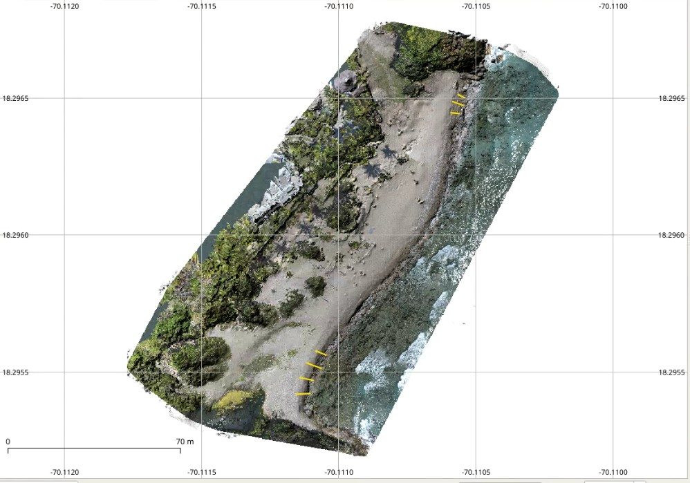

<!-- README.md is generated from README.Rmd. Please edit that file -->

```{r setup, include=FALSE}
knitr::opts_chunk$set(
  echo = TRUE,
  collapse=TRUE,
  out.width='100%',
  fig.path = "img/"
)
```

BeachProfile is a set of R tools that enable users to extract beach profiles from a digital surface model. The tools generate elevation profile graphs showing the slope, a table of associated data, as well as profile concavity calculations. Hopefully, these tools, along with those of the [RCoastSat repo](https://github.com/geofis/RCoastSat) for analysis of time-series of shoreline extracted with [CoastSat](https://github.com/kvos/CoastSat) (an open-source software toolkit written in Python by @kvos), will be part of an R package.

Here I show how to generate seven topographic profiles of Najayo Beach, located in the south-central coast of the Dominican Republic. The input data include a 10-cm resolution digital surface model (DSM) generated from an aerial survey processed with OpenDroneMap and GRASS GIS, as well as a set of transects previously digitized in QGIS.



This repo, the field work and the data collected, are part of assignment projects for the Geomorphology course (Geography Degree), Autonomous University of Santo Domingo. More details in this [video](https://www.youtube.com/watch?v=k6j5pVxvfN0) (in Spanish). Two applications Two applications can be consulted in the links below:

- [Ana's transects](analisis_transectos_ana.md)
- [Carolaine's transects](analisis_transectos_carolain.md)

## Packages

```{r, warning=F, message=F}
library(tidyverse)
library(purrr)
library(sf)
library(RColorBrewer)
library(raster)
```


## Read the functions

```{r, results='hide'}
funs <- list.files('R', pattern = '*.R', full.names = T)
map(funs, source)
```

## Import/plot transects and shorelines

```{r}
# transprof <- rtrans('data/transect-profiles.geojson')
transprof <- rtrans('data/transect-profiles-short.geojson')
rawDsm <- raster('data/raw-dsm.tif')
dsm <- thresholdRaise(rasterDsm = rawDsm, threshold = -28.9)
plot(dsm)
plot(as_Spatial(transprof), add=T)

#ggplot of transects
cols <- colorRampPalette(brewer.pal(9,'Set1'))(nrow(transprof))
ggplot() +
  geom_sf(data = transprof, color = cols) +
  scale_color_manual(values = c('black', 'orange', 'blue')) +
  geom_sf_text(
    data = transprof %>%
      st_centroid, aes(label = transect), size = 4) +
  theme_minimal() +
  theme(legend.title = element_blank())
```

## Profile data

```{r}
profData <- profiles(transects = transprof, height = dsm, pointsPerPixel= 1, movingAvgK = 5)
profData
```

## Profile plots

### Dimensionsional profiles

#### Profiles match their actual digitized extension

```{r}
#Raw distance
dmngridrawd <- profData$dimension %>% drop_units %>% ggplot() +
  aes(x = dist, y = hma) +
  geom_line(col = 'red', lwd = 1, na.rm = T) +
  scale_x_continuous(breaks = pretty_breaks()) +
  scale_y_continuous(breaks = pretty_breaks()) +
  expand_limits(y = -0.05) +
  ylab('Height, moving average (m)') + xlab('Raw distance, landward origin (m)') +
  geom_text(
    data = profData$slope %>% drop_units,
    aes(x = 0, y = 0, label = paste0('m=', round(sloperawdDeg,2), '°')),
    size = 3,
    hjust = 0,
    parse = F
  ) +
  facet_wrap(~transect, nrow = 2, scales = 'free') +
  theme_bw() + 
  theme(text = element_text(size = 12))
dmngridrawd

#Not comparable scales between x and y
dmngridrawd +
  stat_smooth(
    aes(x = dist, y = hma), geom = 'line', color = 'black',
    alpha = 0.5, formula = y~x, method = 'lm', na.rm = T) +
  facet_grid(~transect) 
```

```{r, fig.height=7}
#Equal xy scales, no vertical exaggeration
dmngridrawd + facet_wrap(~transect, nrow = 7) + coord_equal() #Not so informative but panels are comparable

#Equal scales, vertical exaggeration by 2x
dmngridrawd + facet_wrap(~transect, nrow = 7) + coord_equal(ratio = 2)
```

#### Profiles extended to a conventionally chosen zero using linear regression

```{r}
#Not comparable scales, neither between x and y nor across panels
dmngrid <- profData$dimension %>% drop_units %>% ggplot() +
  aes(x = distlm, y = hma) +
  geom_line(col = 'red', lwd = 1, na.rm = T) +
  scale_x_continuous(breaks = pretty_breaks()) +
  scale_y_continuous(breaks = pretty_breaks()) +
  expand_limits(y = -0.05) +
  ylab('Height, moving average (m)') + xlab('Distance, landward origin (m)') +
  geom_text(
    data = profData$slope %>% drop_units,
    aes(x = 0, y = 0, label = paste0('m=', round(slopeDeg,2), '°')),
    size = 3,
    hjust = 0,
    parse = F
  ) +
  facet_wrap(~transect, nrow = 2, scales = 'free') +
  theme_bw() + 
  theme(text = element_text(size = 12))
dmngrid

#Not comparable scales between x and y
dmngrid +
  stat_smooth(
    aes(x = distlm, y = hma), geom = 'line', color = 'black',
    alpha = 0.5, formula = y~x, method = 'lm', na.rm = T) +
  facet_grid(~transect) 
```

```{r, fig.height=7}
#Equal xy scales, no vertical exaggeration
dmngrid + facet_wrap(~transect, nrow = 7) + coord_equal() #Not so informative but panels are comparable

#Equal scales, vertical exaggeration by 2x
dmngrid + facet_wrap(~transect, nrow = 7) + coord_equal(ratio = 2)
```


### Dimensionless, profile concavity indices

#### Profiles match their actual digitized extension

```{r}
dmnlsgridrawd1 <- profData$dimensionlessrawdistance %>% na.omit %>% ggplot() +
  aes(x = dist, y = hma) +
  geom_line(col = 'red', lwd = 1) +
  scale_x_continuous(breaks = pretty_breaks(), limits = c(0,1)) +
  scale_y_continuous(breaks = pretty_breaks(), limits = c(0,1)) +
  geom_text(
    data = profData$concavityindexrawdistance, aes(x = 0.1, y = 0.1, label = paste0('C[a]==', round(ci,2))),
    size = 3,
    hjust = 0,
    parse = T
  ) +
  coord_equal() +
  facet_wrap(~transect, nrow = 2) +
  theme_bw() + 
  theme(text = element_text(size = 12))
dmnlsgridrawd1
```

#### Profiles extended to a conventionally chosen zero using linear regression

```{r}
dmnlsgrid1 <- profData$dimensionless %>% na.omit %>% ggplot() +
  aes(x = distlm, y = hma) +
  geom_line(col = 'red', lwd = 1) +
  scale_x_continuous(breaks = pretty_breaks(), limits = c(0,1)) +
  scale_y_continuous(breaks = pretty_breaks(), limits = c(0,1)) +
  geom_text(
    data = profData$concavityindex, aes(x = 0.1, y = 0.1, label = paste0('C[a]==', round(ci,2))),
    size = 3,
    hjust = 0,
    parse = T
  ) +
  coord_equal() +
  facet_wrap(~transect, nrow = 2) +
  theme_bw() + 
  theme(text = element_text(size = 12))
dmnlsgrid1
```

