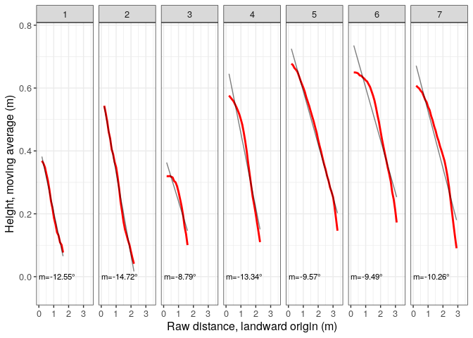
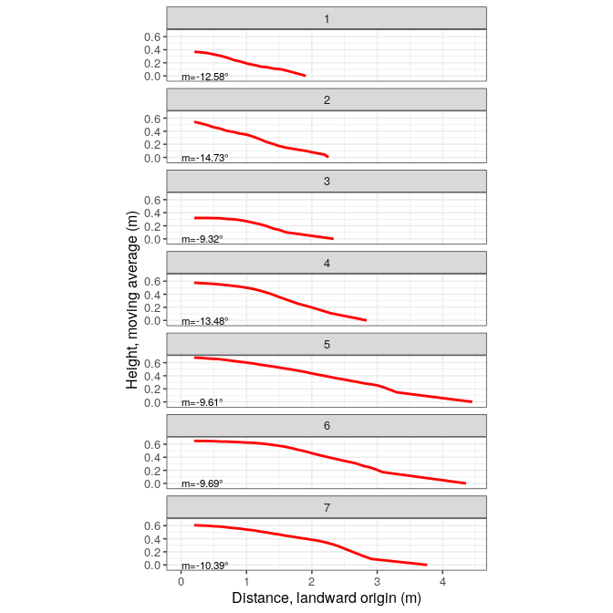

BeachProfile
================

<!-- README.md is generated from README.Rmd. Please edit that file -->
Packages
--------

``` r
library(tidyverse)
library(purrr)
library(sf)
library(RColorBrewer)
library(raster)
```

Read the functions
------------------

``` r
funs <- list.files('R', pattern = '*.R', full.names = T)
map(funs, source)
```

Import/plot transects and shorelines
------------------------------------

``` r
# transprof <- rtrans('data/transect-profiles.geojson')
transprof <- rtrans('data/transect-profiles-short.geojson')
## Reading layer `tst' from data source `/home/jose/Documentos/git/BeachProfile/data/transect-profiles-short.geojson' using driver `GeoJSON'
## Simple feature collection with 7 features and 1 field
## geometry type:  MULTILINESTRING
## dimension:      XY
## bbox:           xmin: 382561.7 ymin: 2023228 xmax: 382627.3 ymax: 2023348
## CRS:            32619
rawDsm <- raster('data/raw-dsm.tif')
dsm <- thresholdRaise(
  rasterDsm = rawDsm, threshold = -28.9,
  outRasterPath = 'out/cleaned-raised-dsm.tif',
  overwrite=T)
plot(dsm)
plot(as_Spatial(transprof), add=T)
```


``` r

#ggplot of transects
cols <- colorRampPalette(brewer.pal(9,'Set1'))(nrow(transprof))
ggplot() +
  geom_sf(data = transprof, color = cols) +
  scale_color_manual(values = c('black', 'orange', 'blue')) +
  geom_sf_text(
    data = transprof %>%
      st_centroid, aes(label = transect), size = 4) +
  theme_minimal() +
  theme(legend.title = element_blank())
## Warning in st_centroid.sf(.): st_centroid assumes attributes are constant
## over geometries of x
```


Profile data
------------

``` r
profData <- profiles(transects = transprof, height = dsm, pointsPerPixel= 1, movingAvgK = 5)
## rgeos version: 0.5-2, (SVN revision 621)
##  GEOS runtime version: 3.6.2-CAPI-1.10.2 
##  Linking to sp version: 1.3-1 
##  Polygon checking: TRUE
## 
## Attaching package: 'scales'
## The following object is masked from 'package:purrr':
## 
##     discard
## The following object is masked from 'package:readr':
## 
##     col_factor
## 
## Attaching package: 'zoo'
## The following objects are masked from 'package:base':
## 
##     as.Date, as.Date.numeric
## udunits system database from /usr/share/xml/udunits
profData
## $dimension
## # A tibble: 198 x 5
##    transect      dist         h       hma    distlm
##    <fct>          [m]       [m]       [m]       [m]
##  1 1        0.0000000 0.3875008        NA        NA
##  2 1        0.1017041 0.3699989        NA        NA
##  3 1        0.2034081 0.3699989 0.3685852 0.2034081
##  4 1        0.3051122 0.3540001 0.3604179 0.3051122
##  5 1        0.4068163 0.3614273 0.3480846 0.4068163
##  6 1        0.5085204 0.3466644 0.3260849 0.5085204
##  7 1        0.6102244 0.3083324 0.3049992 0.6102244
##  8 1        0.7119285 0.2600002 0.2758247 0.7119285
##  9 1        0.8136326 0.2485714 0.2404919 0.8136326
## 10 1        0.9153367 0.2155552 0.2173252 0.9153367
## # … with 188 more rows
## 
## $dimensionless
## # A tibble: 198 x 3
##    transect  distlm    hma
##    <fct>      <dbl>  <dbl>
##  1 1        NA      NA    
##  2 1        NA      NA    
##  3 1         0       1    
##  4 1         0.0597  0.978
##  5 1         0.119   0.944
##  6 1         0.179   0.885
##  7 1         0.239   0.827
##  8 1         0.298   0.748
##  9 1         0.358   0.652
## 10 1         0.418   0.590
## # … with 188 more rows
## 
## $dimensionlessrawdistance
## # A tibble: 198 x 3
##    transect   dist    hma
##    <fct>     <dbl>  <dbl>
##  1 1        0      NA    
##  2 1        0.0556 NA    
##  3 1        0.111   1    
##  4 1        0.167   0.978
##  5 1        0.222   0.944
##  6 1        0.278   0.885
##  7 1        0.333   0.827
##  8 1        0.389   0.748
##  9 1        0.444   0.652
## 10 1        0.500   0.590
## # … with 188 more rows
## 
## $concavityindex
## # A tibble: 7 x 2
##   transect       ci
##   <fct>       <dbl>
## 1 1        -0.0478 
## 2 2         0.00179
## 3 3        -0.168  
## 4 4        -0.140  
## 5 5        -0.0591 
## 6 6        -0.142  
## 7 7        -0.109  
## 
## $concavityindexrawdistance
## # A tibble: 7 x 2
##   transect      ci
##   <fct>      <dbl>
## 1 1         0.0562
## 2 2         0.147 
## 3 3        -0.252 
## 4 4        -0.168 
## 5 5        -0.216 
## 6 6        -0.305 
## 7 7        -0.228 
## 
## $slope
## # A tibble: 7 x 10
##   transect       dh  ddistlm    slope slopeRad slopeDeg distrawd sloperawd
##   <fct>         [m]      [m]      [1]    [rad]      [°]      [m]       [1]
## 1 1        0.36858… 1.704848 -0.2232… -0.2196… -12.582… 1.830673 -0.22258…
## 2 2        0.54380… 2.054376 -0.2628… -0.2570… -14.729… 2.397880 -0.26266…
## 3 3        0.32014… 2.133634 -0.1640… -0.1625…  -9.315… 1.806913 -0.15460…
## 4 4        0.57606… 2.639010 -0.2397… -0.2353… -13.484… 2.485144 -0.23709…
## 5 5        0.67762… 4.253488 -0.1692… -0.1676…  -9.606… 3.499681 -0.16867…
## 6 6        0.64976… 4.159920 -0.1708… -0.1691…  -9.692… 3.381480 -0.16724…
## 7 7        0.60763… 3.563589 -0.1834… -0.1813… -10.393… 3.115295 -0.18101…
## # … with 2 more variables: sloperawdRad [rad], sloperawdDeg [°]
```

Profile plots
-------------

### Unit dimensions

``` r
#Not comparable scales, neither between x and y nor across panels
dmngrid <- profData$dimension %>% drop_units %>% ggplot() +
  aes(x = distlm, y = hma) +
  geom_line(col = 'red', lwd = 1, na.rm = T) +
  scale_x_continuous(breaks = pretty_breaks()) +
  scale_y_continuous(breaks = pretty_breaks()) +
  expand_limits(y = -0.05) +
  ylab('Height, moving average (m)') + xlab('Distance, landward origin (m)') +
  geom_text(
    data = profData$slope %>% drop_units,
    aes(x = 0, y = 0, label = paste0('m=', round(slopeDeg,2), '°')),
    size = 3,
    hjust = 0,
    parse = F
  ) +
  facet_wrap(~transect, nrow = 2, scales = 'free') +
  theme_bw() + 
  theme(text = element_text(size = 12))
dmngrid
```


``` r

#Not comparable scales between x and y
dmngrid +
  stat_smooth(
    aes(x = distlm, y = hma), geom = 'line', color = 'black',
    alpha = 0.5, formula = y~x, method = 'lm', na.rm = T) +
  facet_grid(~transect) 
```



``` r
#Equal xy scales, no vertical exaggeration
dmngrid + facet_wrap(~transect, nrow = 7) + coord_equal() #Not so informative but panels are comparable
```


``` r

#Equal scales, vertical exaggeration by 2x
dmngrid + facet_wrap(~transect, nrow = 7) + coord_equal(ratio = 2)
```


``` r
#Raw distance
dmngridrawd <- profData$dimension %>% drop_units %>% ggplot() +
  aes(x = dist, y = hma) +
  geom_line(col = 'red', lwd = 1, na.rm = T) +
  scale_x_continuous(breaks = pretty_breaks()) +
  scale_y_continuous(breaks = pretty_breaks()) +
  expand_limits(y = -0.05) +
  ylab('Height, moving average (m)') + xlab('Raw distance, landward origin (m)') +
  geom_text(
    data = profData$slope %>% drop_units,
    aes(x = 0, y = 0, label = paste0('m=', round(sloperawdDeg,2), '°')),
    size = 3,
    hjust = 0,
    parse = F
  ) +
  facet_wrap(~transect, nrow = 2, scales = 'free') +
  theme_bw() + 
  theme(text = element_text(size = 12))
dmngridrawd
```


``` r

#Not comparable scales between x and y
dmngridrawd +
  stat_smooth(
    aes(x = dist, y = hma), geom = 'line', color = 'black',
    alpha = 0.5, formula = y~x, method = 'lm', na.rm = T) +
  facet_grid(~transect) 
```


``` r
#Equal xy scales, no vertical exaggeration
dmngridrawd + facet_wrap(~transect, nrow = 7) + coord_equal() #Not so informative but panels are comparable
```



``` r

#Equal scales, vertical exaggeration by 2x
dmngridrawd + facet_wrap(~transect, nrow = 7) + coord_equal(ratio = 2)
```


### Dimensionless, profile concavity indices

``` r
dmnlsgrid1 <- profData$dimensionless %>% na.omit %>% ggplot() +
  aes(x = distlm, y = hma) +
  geom_line(col = 'red', lwd = 1) +
  scale_x_continuous(breaks = pretty_breaks(), limits = c(0,1)) +
  scale_y_continuous(breaks = pretty_breaks(), limits = c(0,1)) +
  geom_text(
    data = profData$concavityindex, aes(x = 0.1, y = 0.1, label = paste0('C[a]==', round(ci,2))),
    size = 3,
    hjust = 0,
    parse = T
  ) +
  coord_equal() +
  facet_wrap(~transect, nrow = 2) +
  theme_bw() + 
  theme(text = element_text(size = 12))
dmnlsgrid1
```


``` r

dmnlsgridrawd1 <- profData$dimensionlessrawdistance %>% na.omit %>% ggplot() +
  aes(x = dist, y = hma) +
  geom_line(col = 'red', lwd = 1) +
  scale_x_continuous(breaks = pretty_breaks(), limits = c(0,1)) +
  scale_y_continuous(breaks = pretty_breaks(), limits = c(0,1)) +
  geom_text(
    data = profData$concavityindexrawdistance, aes(x = 0.1, y = 0.1, label = paste0('C[a]==', round(ci,2))),
    size = 3,
    hjust = 0,
    parse = T
  ) +
  coord_equal() +
  facet_wrap(~transect, nrow = 2) +
  theme_bw() + 
  theme(text = element_text(size = 12))
dmnlsgridrawd1
```


