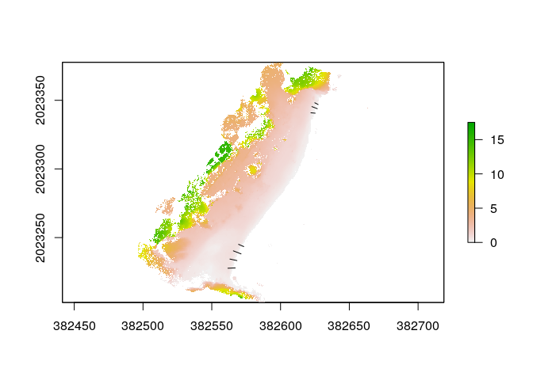
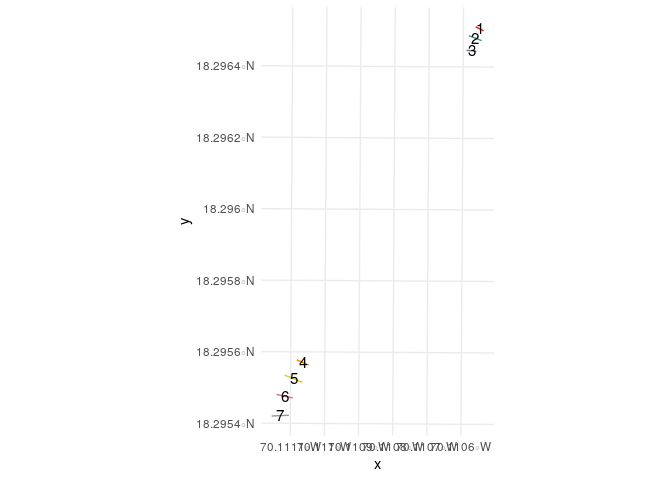
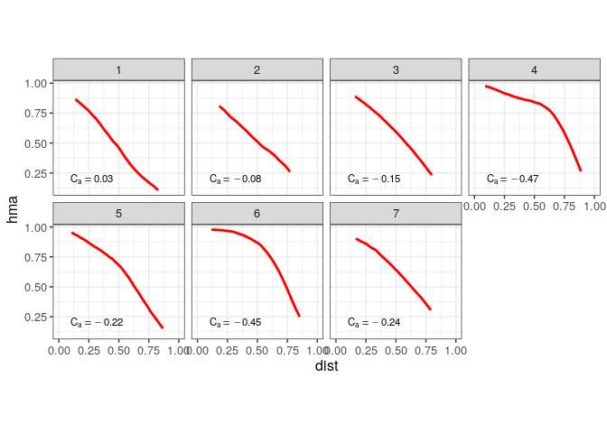

BeachProfile
================

<!-- README.md is generated from README.Rmd. Please edit that file -->
Packages
--------

``` r
library(tidyverse)
library(purrr)
library(sf)
library(RColorBrewer)
library(raster)
```

Read the functions
------------------

``` r
funs <- list.files('R', pattern = '*.R', full.names = T)
map(funs, source)
```

Import/plot transects and shorelines
------------------------------------

``` r
# transprof <- rtrans('data/transect-profiles.geojson')
transprof <- rtrans('data/transect-profiles-short.geojson')
## Reading layer `tst' from data source `/home/jose/Documentos/git/BeachProfile/data/transect-profiles-short.geojson' using driver `GeoJSON'
## Simple feature collection with 7 features and 1 field
## geometry type:  MULTILINESTRING
## dimension:      XY
## bbox:           xmin: 382561.7 ymin: 2023228 xmax: 382625.2 ymax: 2023349
## CRS:            32619
dsm <- raster('data/dsm.tif')
plot(dsm)
plot(as_Spatial(transprof), add=T)
```



``` r

#ggplot of transects
cols <- colorRampPalette(brewer.pal(9,'Set1'))(nrow(transprof))
ggplot() +
  geom_sf(data = transprof, color = cols) +
  scale_color_manual(values = c('black', 'orange', 'blue')) +
  geom_sf_text(
    data = transprof %>%
      st_centroid, aes(label = transect), size = 4) +
  theme_minimal() +
  theme(legend.title = element_blank())
## Warning in st_centroid.sf(.): st_centroid assumes attributes are constant
## over geometries of x
```



Profiles
--------

``` r
prof <- profiles(transects = transprof, height = dsm, facetRows = 2, movingAvgK = 10)
## rgeos version: 0.5-2, (SVN revision 621)
##  GEOS runtime version: 3.6.2-CAPI-1.10.2 
##  Linking to sp version: 1.3-1 
##  Polygon checking: TRUE
## 
## Attaching package: 'scales'
## The following object is masked from 'package:purrr':
## 
##     discard
## The following object is masked from 'package:readr':
## 
##     col_factor
## 
## Attaching package: 'zoo'
## The following objects are masked from 'package:base':
## 
##     as.Date, as.Date.numeric
prof
## [[1]]
## # A tibble: 224 x 4
## # Groups:   transect [7]
##    transect   dist     h    hma
##    <fct>     <dbl> <dbl>  <dbl>
##  1 1        0      1     NA    
##  2 1        0.0345 0.969 NA    
##  3 1        0.0690 0.933 NA    
##  4 1        0.103  0.933 NA    
##  5 1        0.138  0.874  0.867
##  6 1        0.172  0.866  0.837
##  7 1        0.207  0.864  0.807
##  8 1        0.241  0.786  0.777
##  9 1        0.276  0.767  0.739
## 10 1        0.310  0.677  0.703
## # … with 214 more rows
## 
## [[2]]
## Warning: Removed 9 rows containing missing values (geom_path).
```


