BeachProfile
================

<!-- README.md is generated from README.Rmd. Please edit that file -->

BeachProfile is a set of R tools that enable users to extract beach
profiles from a digital surface model. The tools generate elevation
profile graphs showing the slope, a table of associated data, as well as
profile concavity calculations. Hopefully, these tools, along with those
of the [RCoastSat repo](https://github.com/geofis/RCoastSat) for
analysis of time-series of shoreline extracted with
[CoastSat](https://github.com/kvos/CoastSat) (an open-source software
toolkit written in Python by @kvos), will be part of an R package.

Here I show how to generate seven topographic profiles of Najayo Beach,
located in the south-central coast of the Dominican Republic. The input
data include a 10-cm resolution digital surface model (DSM) generated
from an aerial survey processed with OpenDroneMap and GRASS GIS, as well
as a set of transects previously digitized in QGIS.


This repo, the field work and the data collected, are part of assignment
projects for the Geomorphology course (Geography Degree), Autonomous
University of Santo Domingo. More details in this
[video](https://www.youtube.com/watch?v=k6j5pVxvfN0) (in Spanish).

## Packages

``` r
library(tidyverse)
library(purrr)
library(sf)
library(RColorBrewer)
library(raster)
```

## Read the functions

``` r
funs <- list.files('R', pattern = '*.R', full.names = T)
map(funs, source)
```

## Import/plot transects and shorelines

``` r
transprof <- rtrans('data/perfil_carlos_pinto.geojson')#Digitized by Ana, edited by geofis
## Reading layer `perfil_carlos_pinto' from data source `/home/jr/Documentos/git/BeachProfile/data/perfil_carlos_pinto.geojson' using driver `GeoJSON'
## Simple feature collection with 48 features and 1 field
## geometry type:  LINESTRING
## dimension:      XY
## bbox:           xmin: 382563 ymin: 2023223 xmax: 382625.5 ymax: 2023345
## epsg (SRID):    32619
## proj4string:    +proj=utm +zone=19 +datum=WGS84 +units=m +no_defs
rawDsm <- raster('data/raw-dsm.tif')
dsm <- thresholdRaise(rasterDsm = rawDsm, threshold = -29)
plot(dsm)
plot(as_Spatial(transprof), add=T)
```


``` r

#ggplot of transects
cols <- colorRampPalette(brewer.pal(9,'Set1'))(nrow(transprof))
ggplot() +
  geom_sf(data = transprof, color = cols) +
  scale_color_manual(values = c('black', 'orange', 'blue')) +
  geom_sf_text(
    data = transprof %>%
      st_centroid, aes(label = transect), size = 3) +
  theme_minimal() +
  theme(legend.title = element_blank())
## Warning in st_centroid.sf(.): st_centroid assumes attributes are constant
## over geometries of x
```


## Profile data

``` r
profData_temp <- profiles(transects = transprof, height = dsm,
                          pointsPerPixel= 2, movingAvgK = 3)
## rgeos version: 0.5-1, (SVN revision 614)
##  GEOS runtime version: 3.6.2-CAPI-1.10.2 
##  Linking to sp version: 1.3-1 
##  Polygon checking: TRUE
## 
## Attaching package: 'scales'
## The following object is masked from 'package:purrr':
## 
##     discard
## The following object is masked from 'package:readr':
## 
##     col_factor
## 
## Attaching package: 'zoo'
## The following objects are masked from 'package:base':
## 
##     as.Date, as.Date.numeric
## udunits system database from /usr/share/xml/udunits
profData_temp
## $dimension
## # A tibble: 1,933 x 5
##    transect       dist         h       hma     distlm
##    <fct>           [m]       [m]       [m]        [m]
##  1 1        0.00000000 0.6557159        NA         NA
##  2 1        0.04959511 0.6225014 0.6460730 0.04959511
##  3 1        0.09919021 0.6600018 0.6283340 0.09919021
##  4 1        0.14878532 0.6024990 0.6216666 0.14878532
##  5 1        0.19838043 0.6024990 0.5916665 0.19838043
##  6 1        0.24797553 0.5700016 0.5808341 0.24797553
##  7 1        0.29757064 0.5700016 0.5708345 0.29757064
##  8 1        0.34716575 0.5725002 0.5716674 0.34716575
##  9 1        0.39676085 0.5725002 0.5626195 0.39676085
## 10 1        0.44635596 0.5428581 0.5527388 0.44635596
## # … with 1,923 more rows
## 
## $dimensionless
## # A tibble: 1,933 x 3
##    transect  distlm    hma
##    <fct>      <dbl>  <dbl>
##  1 1        NA      NA    
##  2 1         0       1    
##  3 1         0.0196  0.973
##  4 1         0.0391  0.962
##  5 1         0.0587  0.916
##  6 1         0.0782  0.899
##  7 1         0.0978  0.884
##  8 1         0.117   0.885
##  9 1         0.137   0.871
## 10 1         0.156   0.856
## # … with 1,923 more rows
## 
## $dimensionlessrawdistance
## # A tibble: 1,933 x 3
##    transect   dist    hma
##    <fct>     <dbl>  <dbl>
##  1 1        0      NA    
##  2 1        0.0189  1    
##  3 1        0.0377  0.973
##  4 1        0.0566  0.962
##  5 1        0.0755  0.916
##  6 1        0.0943  0.899
##  7 1        0.113   0.884
##  8 1        0.132   0.885
##  9 1        0.151   0.871
## 10 1        0.170   0.856
## # … with 1,923 more rows
## 
## $concavityindex
## # A tibble: 48 x 2
##    transect       ci
##    <fct>       <dbl>
##  1 1         0.00491
##  2 10       -0.0376 
##  3 11       -0.137  
##  4 12       -0.0752 
##  5 13       -0.0507 
##  6 14        0.0308 
##  7 15        0.00645
##  8 16       -0.0192 
##  9 17       -0.0404 
## 10 18        0.0260 
## # … with 38 more rows
## 
## $concavityindexrawdistance
## # A tibble: 48 x 2
##    transect      ci
##    <fct>      <dbl>
##  1 1         0.0400
##  2 10       -0.444 
##  3 11       -0.104 
##  4 12       -0.183 
##  5 13       -0.131 
##  6 14       -0.237 
##  7 15       -0.0116
##  8 16       -0.170 
##  9 17       -0.220 
## 10 18       -0.279 
## # … with 38 more rows
## 
## $slope
## # A tibble: 48 x 10
##    transect       dh  ddistlm    slope slopeRad slopeDeg distrawd sloperawd
##    <fct>         [m]      [m]      [1]    [rad]      [°]      [m]       [1]
##  1 1        0.64607… 2.536063 -0.2514… -0.2463… -14.112… 2.628541 -0.25129…
##  2 10       0.36474… 3.224920 -0.1138… -0.1133…  -6.492… 2.100700 -0.11046…
##  3 11       0.38044… 2.783110 -0.1493… -0.1482…  -8.495… 2.864696 -0.14904…
##  4 12       0.42416… 3.657225 -0.1222… -0.1215…  -6.967… 3.290392 -0.12197…
##  5 13       0.40607… 3.344898 -0.1197… -0.1191…  -6.826… 3.104072 -0.11908…
##  6 14       0.33585… 4.118233 -0.0787… -0.0785…  -4.502… 3.106799 -0.07828…
##  7 15       0.35848… 3.419921 -0.1024… -0.1021…  -5.850… 3.347936 -0.10238…
##  8 16       0.38036… 4.211063 -0.0915… -0.0912…  -5.230… 3.620599 -0.09140…
##  9 17       0.32417… 4.344921 -0.0733… -0.0731…  -4.192… 3.662199 -0.07282…
## 10 18       0.22000… 3.952029 -0.0531… -0.0530…  -3.041… 2.877792 -0.05228…
## # … with 38 more rows, and 2 more variables: sloperawdRad [rad],
## #   sloperawdDeg [°]
```

## Prepare data to accommodate 48 profiles

``` r
profData <- lapply(profData_temp, function(x)
  x %>% mutate(
    transect2 = as.numeric(as.character(transect)),
    group = cut(transect2,
                breaks = c(0, 10, 20, 30, 40, 50),
                labels = c('1-10', '11-20', '21-30', '31-40', '41-48')),
  transect = forcats::fct_relevel(
    transect, function(x){as.character(sort(as.integer(x)))})
  )
)
```

## Profile plots

### Dimensionsional profiles

#### Profiles match their actual digitized extension (raw distance)

##### xy scales different, scale non-consistent across panels

``` r
#Raw distance
dmngridrawd <- sapply(as.character(unique(profData$dimension$group)), function(x) {
  profData$dimension %>% filter(group==x) %>% drop_units %>% droplevels %>%
    ggplot() +
      aes(x = dist, y = hma) +
      geom_path(col = 'red', lwd = 1, na.rm = T) +
      scale_x_continuous(breaks = pretty_breaks()) +
      scale_y_continuous(breaks = pretty_breaks()) +
      expand_limits(y = -0.05) +
      ylab('Height, moving average (m)') + xlab('Raw distance, landward origin (m)') +
      geom_text(
        data = profData$slope %>% filter(group==x) %>% drop_units %>% droplevels,
        aes(x = 0, y = 0, label = paste0('m=', round(sloperawdDeg,2), '°')),
        size = 3,
        hjust = 0,
        parse = F
      ) +
      facet_wrap(~transect, nrow = 2, scales = 'free') +
      theme_bw() + 
      theme(text = element_text(size = 8))
}, simplify = F, USE.NAMES = T)
invisible(sapply(
  names(dmngridrawd),
  function(x) print(dmngridrawd[[x]])
))
```

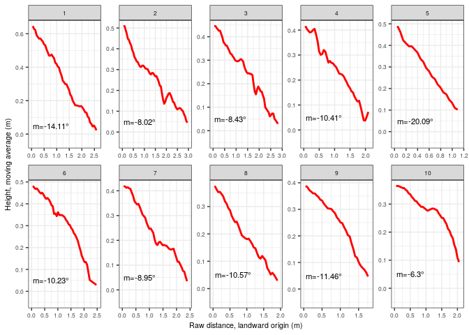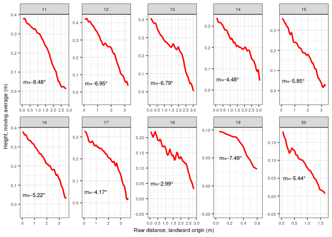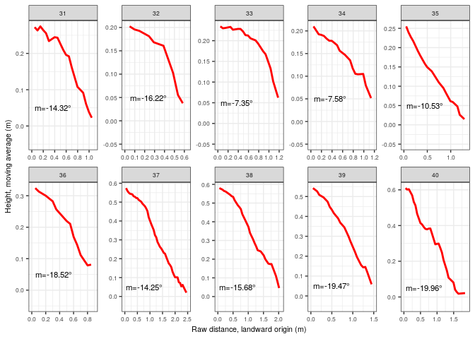

##### xy scales different, scale consistent across panels of the same plot

``` r
invisible(sapply(
  names(dmngridrawd),
  function(x) {
    p <- dmngridrawd[[x]] +
      stat_smooth(
        aes(x = dist, y = hma), geom = 'line', color = 'black',
        alpha = 0.5, formula = y~x, method = 'lm', na.rm = T) +
      facet_wrap(~transect, nrow = 2)
    print(p)
  }
))
```

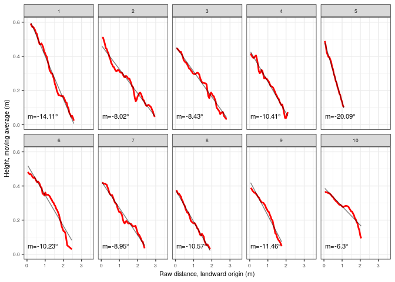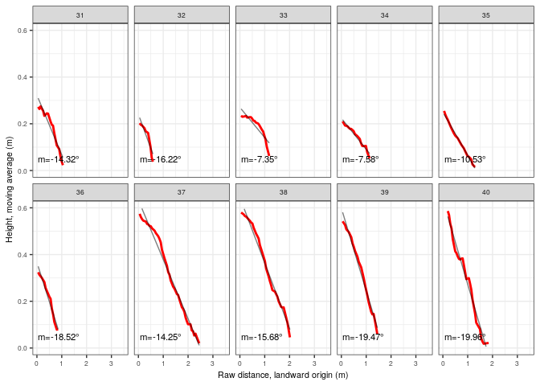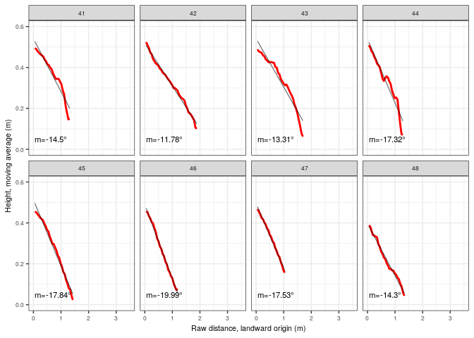

##### xy scales equal (no vertical exaggeration), scale consistent across panels of the same plot

``` r
#Equal xy scales, no vertical exaggeration
invisible(sapply(
  names(dmngridrawd),
  function(x) {
    p <- dmngridrawd[[x]] + facet_wrap(~transect, nrow = 5) + coord_equal() #Not so informative but panels are comparable between each other
    print(p)
  }
))
```

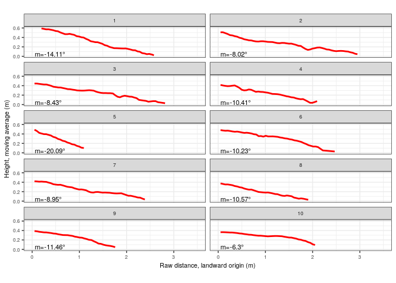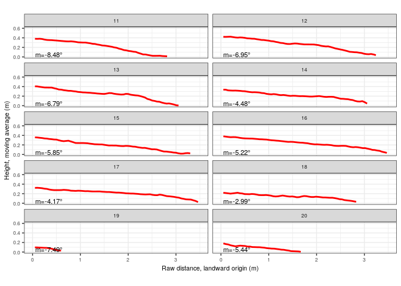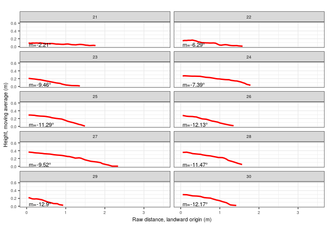

##### Vertical exaggeration 2x, scale consistent across panels of the same plot

``` r
invisible(sapply(
  names(dmngridrawd),
  function(x) {
    p <- dmngridrawd[[x]] + facet_wrap(~transect, nrow = 5) + coord_equal(ratio = 2) #Not so informative but panels are comparable
    print(p)
  }
))
```

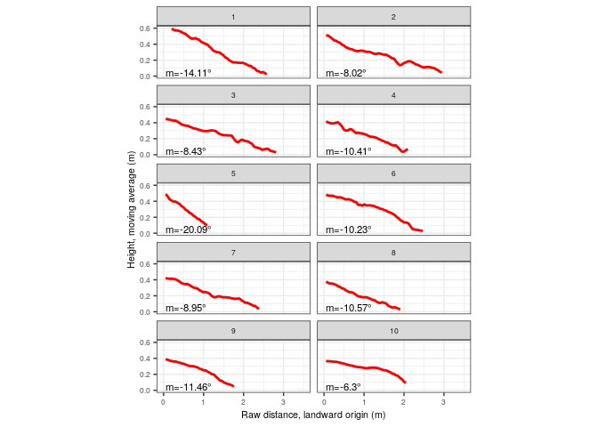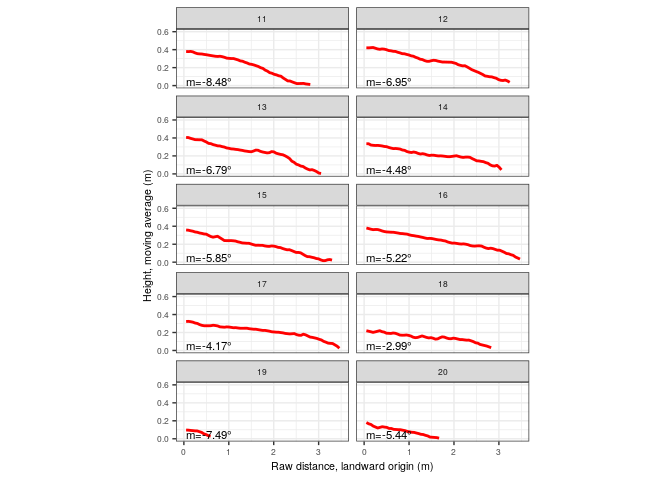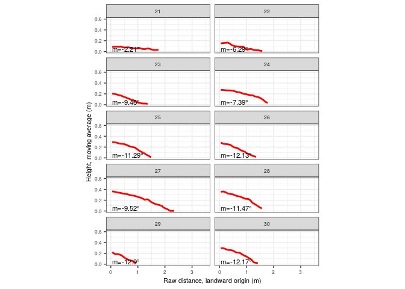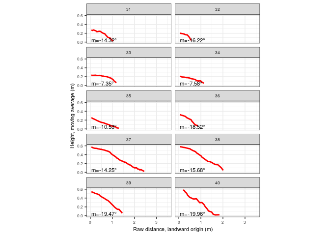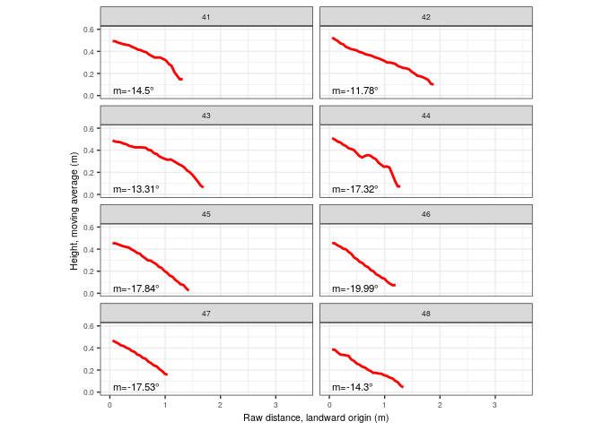

#### Profiles extended to a conventionally chosen zero using linear regression

##### xy scales different, scale non-consistent across panels

``` r
dmngrid <- sapply(as.character(unique(profData$dimension$group)), function(x) {
  profData$dimension %>% filter(group==x) %>% drop_units %>% ggplot() +
    aes(x = distlm, y = hma) +
    geom_line(col = 'red', lwd = 1, na.rm = T) +
    scale_x_continuous(breaks = pretty_breaks()) +
    scale_y_continuous(breaks = pretty_breaks()) +
    expand_limits(y = -0.05) +
    ylab('Height, moving average (m)') + xlab('Distance, landward origin (m)') +
    geom_text(
      data = profData$slope %>% filter(group==x) %>% drop_units,
      aes(x = 0, y = 0, label = paste0('m=', round(slopeDeg,2), '°')),
      size = 3,
      hjust = 0,
      parse = F
    ) +
    facet_wrap(~transect, nrow = 2, scales = 'free') +
    theme_bw() + 
    theme(text = element_text(size = 8))
}, simplify = F, USE.NAMES = T)

invisible(sapply(
  names(dmngrid),
  function(x) {
    print(dmngrid[[x]])
  }
))
```


##### xy scales different, scale consistent across panels of the same plot

``` r
invisible(sapply(
  names(dmngrid),
  function(x) {
    p <- dmngrid[[x]] +
      stat_smooth(
        aes(x = distlm, y = hma), geom = 'line', color = 'black',
        alpha = 0.5, formula = y~x, method = 'lm', na.rm = T) +
      facet_wrap(~transect, nrow = 2) 
    print(p)
  }
))
```

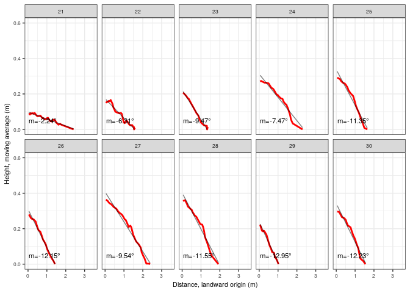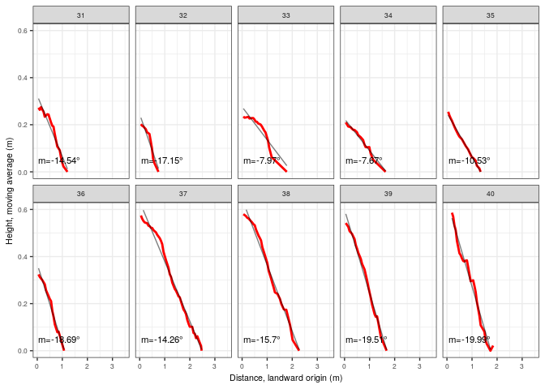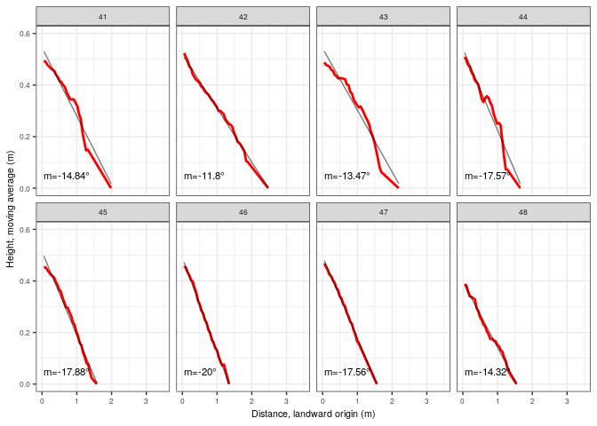

##### xy scales equal (no vertical exaggeration), scale consistent across panels of the same plot

``` r
invisible(sapply(
  names(dmngrid),
  function(x) {
    p <- dmngrid[[x]] +
      stat_smooth(
        aes(x = distlm, y = hma), geom = 'line', color = 'black',
        alpha = 0.5, formula = y~x, method = 'lm', na.rm = T) +
      facet_wrap(~transect, nrow = 5) + coord_equal()
    print(p)
  }
))
```

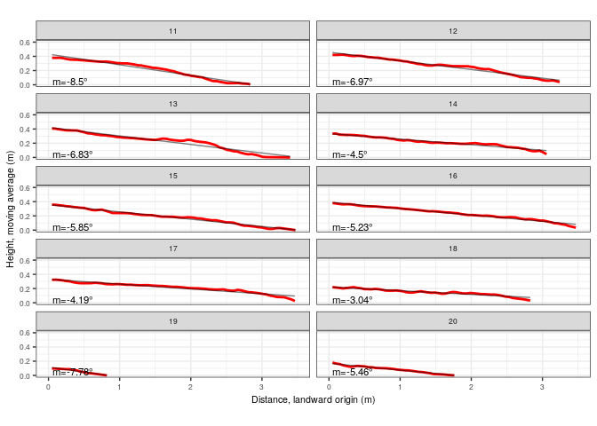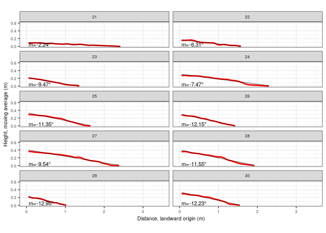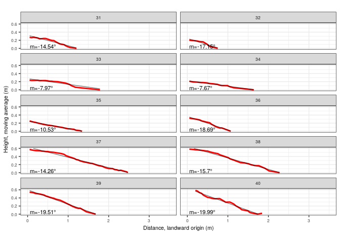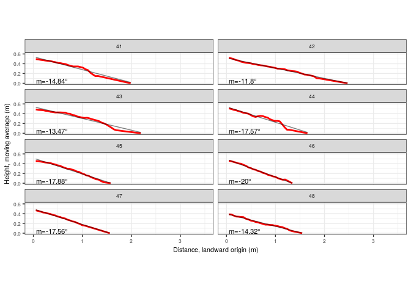
\#\#\#\#\# Vertical exaggeration 2x, scale consistent across panels of
the same plot

``` r
invisible(sapply(
  names(dmngrid),
  function(x) {
    p <- dmngrid[[x]] + facet_wrap(~transect, nrow = 5) + coord_equal(ratio = 2) #Not so informative but panels are comparable
    print(p)
  }
))
```


### Dimensionless, profile concavity indices

#### Profiles match their actual digitized extension

``` r
dmnlsgridrawd1 <- sapply(
  as.character(unique(profData$dimensionlessrawdistance$group)), function(x) {
    profData$dimensionlessrawdistance %>% filter(group == x) %>% na.omit %>% ggplot() +
      aes(x = dist, y = hma) +
      geom_line(col = 'red', lwd = 1) +
      scale_x_continuous(breaks = pretty_breaks(), limits = c(0,1)) +
      scale_y_continuous(breaks = pretty_breaks(), limits = c(0,1)) +
      geom_text(
        data = profData$concavityindexrawdistance %>% filter(group==x),
          aes(x = 0.1, y = 0.1, label = paste0('C[a]==', round(ci,2))),
          size = 3,
          hjust = 0,
          parse = T
      ) +
      coord_equal() +
      facet_wrap(~transect, nrow = 3) +
      theme_bw() + 
      theme(text = element_text(size = 9))
    }, simplify = F, USE.NAMES = T
)
invisible(sapply(
  names(dmnlsgridrawd1),
  function(x) print(dmnlsgridrawd1[[x]])
))
```


#### Profiles extended to a conventionally chosen zero using linear regression

``` r
dmnlsgrid1 <- sapply(
  as.character(unique(profData$dimensionless$group)), function(x) {
    profData$dimensionless %>% filter(group == x) %>% na.omit %>% ggplot() +
      aes(x = distlm, y = hma) +
      geom_line(col = 'red', lwd = 1) +
      scale_x_continuous(breaks = pretty_breaks(), limits = c(0,1)) +
      scale_y_continuous(breaks = pretty_breaks(), limits = c(0,1)) +
      geom_text(
        data = profData$concavityindex %>% filter(group==x),
          aes(x = 0.1, y = 0.1, label = paste0('C[a]==', round(ci,2))),
          size = 3,
          hjust = 0,
          parse = T
      ) +
      coord_equal() +
      facet_wrap(~transect, nrow = 3) +
      theme_bw() + 
      theme(text = element_text(size = 9))
    }, simplify = F, USE.NAMES = T
)
invisible(sapply(
  names(dmnlsgrid1),
  function(x) print(dmnlsgrid1[[x]])
))
```


