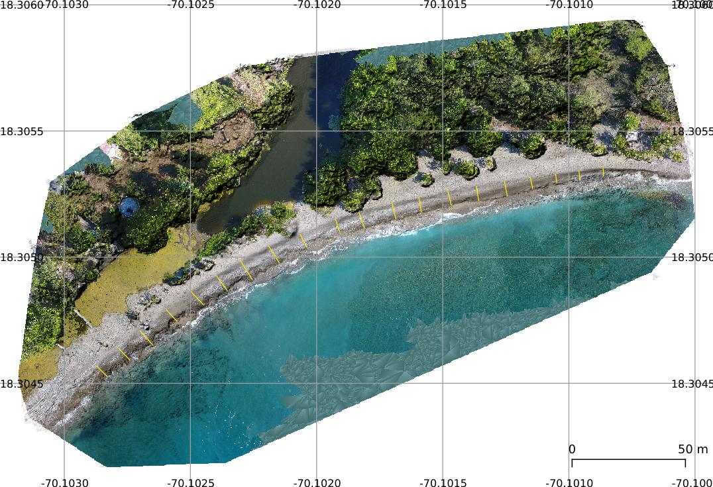

<!-- README.md is generated from README.Rmd. Please edit that file -->

```{r setup, include=FALSE}
knitr::opts_chunk$set(
  echo = TRUE,
  collapse=TRUE,
  out.width='100%',
  fig.path = "img/"
)
```

BeachProfile is a set of R tools that enable users to extract beach profiles from a digital surface model. The tools generate elevation profile graphs showing the slope, a table of associated data, as well as profile concavity calculations. Hopefully, these tools, along with those of the [RCoastSat repo](https://github.com/geofis/RCoastSat) for analysis of time-series of shoreline extracted with [CoastSat](https://github.com/kvos/CoastSat) (an open-source software toolkit written in Python by @kvos), will be part of an R package.

Here I show how to generate 20 topographic profiles of Najayo Beach (Los Pescadores sector), located in the south-central coast of the Dominican Republic. The input data include a 10-cm resolution digital surface model (DSM) generated from an aerial survey processed with OpenDroneMap and GRASS GIS, as well as a set of transects previously digitized in QGIS.



This repo, the field work and the data collected, are part of assignment projects for the Geomorphology course (Geography Degree), Autonomous University of Santo Domingo. More details in this [video](https://www.youtube.com/watch?v=k6j5pVxvfN0) (in Spanish).

## Packages

```{r, warning=F, message=F}
library(tidyverse)
library(purrr)
library(sf)
library(RColorBrewer)
library(raster)
```


## Read the functions

```{r, results='hide'}
funs <- list.files('R', pattern = '*.R', full.names = T)
map(funs, source)
```

## Import/plot transects and shorelines

```{r carolain-transect}
transprof <- rtrans('data/perfil_los_pescadores.geojson')#Digitized by Carolain, edited by geofis
rawDsm <- raster('data/raw-dsm-pescadores.tif')
dsm <- thresholdRaise(rasterDsm = rawDsm, threshold = -44.1)
plot(dsm)
plot(as_Spatial(transprof), add=T)

#ggplot of transects
cols <- colorRampPalette(brewer.pal(9,'Set1'))(nrow(transprof))
ggplot() +
  geom_sf(data = transprof, color = cols) +
  scale_color_manual(values = c('black', 'orange', 'blue')) +
  geom_sf_text(
    data = transprof %>%
      st_centroid, aes(label = transect), size = 3) +
  theme_minimal() +
  theme(legend.title = element_blank())
```

## Profile data

```{r}
profData_temp <- profiles(transects = transprof, height = dsm,
                          pointsPerPixel= 2, movingAvgK = 3)
profData_temp
```


## Prepare data to accommodate 48 profiles

```{r}
profData <- lapply(profData_temp, function(x)
  x %>% mutate(
    transect2 = as.numeric(as.character(transect)),
    group = cut(transect2,
                breaks = c(0, 5, 10, 15, 20),
                labels = c('1-5', '6-10', '11-15', '16-20')),
  transect = forcats::fct_relevel(
    transect, function(x){as.character(sort(as.integer(x)))})
  )
)
```

## Profile plots

### Dimensionsional profiles

#### Profiles match their actual digitized extension (raw distance)

##### xy scales different, scale non-consistent across panels

```{r carolain-raw-distance-diff-scales-xy-and-panels}
#Raw distance
dmngridrawd <- sapply(as.character(unique(profData$dimension$group)), function(x) {
  profData$dimension %>% filter(group==x) %>% drop_units %>% droplevels %>%
    ggplot() +
      aes(x = dist, y = hma) +
      geom_path(col = 'red', lwd = 1, na.rm = T) +
      scale_x_continuous(breaks = pretty_breaks()) +
      scale_y_continuous(breaks = pretty_breaks()) +
      expand_limits(y = -0.05) +
      ylab('Height, moving average (m)') + xlab('Raw distance, landward origin (m)') +
      geom_text(
        data = profData$slope %>% filter(group==x) %>% drop_units %>% droplevels,
        aes(x = 0, y = 0, label = paste0('m=', round(sloperawdDeg,2), '°')),
        size = 3,
        hjust = 0,
        parse = F
      ) +
      facet_wrap(~transect, nrow = 2, scales = 'free') +
      theme_bw() + 
      theme(text = element_text(size = 8))
}, simplify = F, USE.NAMES = T)
invisible(sapply(
  names(dmngridrawd),
  function(x) print(dmngridrawd[[x]])
))
```

##### xy scales different, scale consistent across panels

```{r carolain-raw-distance-diff-scales-xy-same-across-panels}
invisible(sapply(
  names(dmngridrawd),
  function(x) {
    p <- dmngridrawd[[x]] +
      stat_smooth(
        aes(x = dist, y = hma), geom = 'line', color = 'black',
        alpha = 0.5, formula = y~x, method = 'lm', na.rm = T) +
      scale_x_continuous(limits = c(0,13)) +
      scale_y_continuous(limits = c(0,2.5)) +
      facet_wrap(~transect, nrow = 2)
    print(p)
  }
))
```

##### xy scales equal (no vertical exaggeration), scale consistent across panels

```{r carolain-raw-distance-same-scale-xy-same-across-panels}
#Equal xy scales, no vertical exaggeration
invisible(sapply(
  names(dmngridrawd),
  function(x) {
    p <- dmngridrawd[[x]] +
      scale_x_continuous(limits = c(0,13)) +
      scale_y_continuous(limits = c(0,2.5)) +
      facet_wrap(~transect, nrow = 5) +
      coord_equal() #Not so informative but panels are comparable between each other
    print(p)
  }
))
```

##### Vertical exaggeration 2x, scale consistent across panels

```{r carolain-raw-distance-vert-exag-2x-same-across-panels}
invisible(sapply(
  names(dmngridrawd),
  function(x) {
    p <- dmngridrawd[[x]] +
      scale_x_continuous(limits = c(0,13)) +
      scale_y_continuous(limits = c(0,2.5)) +      
      facet_wrap(~transect, nrow = 5) +
      coord_equal(ratio = 2) #Not so informative but panels are comparable
    print(p)
  }
))
```

#### Profiles extended to a conventionally chosen zero using linear regression

##### xy scales different, scale non-consistent across panels

```{r carolain-extended-distance-diff-scales-xy-and-panels}
dmngrid <- sapply(as.character(unique(profData$dimension$group)), function(x) {
  profData$dimension %>% filter(group==x) %>% drop_units %>% ggplot() +
    aes(x = distlm, y = hma) +
    geom_line(col = 'red', lwd = 1, na.rm = T) +
    scale_x_continuous(breaks = pretty_breaks()) +
    scale_y_continuous(breaks = pretty_breaks()) +
    expand_limits(y = -0.05) +
    ylab('Height, moving average (m)') + xlab('Distance, landward origin (m)') +
    geom_text(
      data = profData$slope %>% filter(group==x) %>% drop_units,
      aes(x = 0, y = 0, label = paste0('m=', round(slopeDeg,2), '°')),
      size = 3,
      hjust = 0,
      parse = F
    ) +
    facet_wrap(~transect, nrow = 2, scales = 'free') +
    theme_bw() + 
    theme(text = element_text(size = 8))
}, simplify = F, USE.NAMES = T)

invisible(sapply(
  names(dmngrid),
  function(x) {
    print(dmngrid[[x]])
  }
))
```

##### xy scales different, scale consistent across panels

```{r carolain-extended-distance-diff-scales-xy-same-across-panels}
invisible(sapply(
  names(dmngrid),
  function(x) {
    p <- dmngrid[[x]] +
      stat_smooth(
        aes(x = distlm, y = hma), geom = 'line', color = 'black',
        alpha = 0.5, formula = y~x, method = 'lm', na.rm = T) +
      scale_x_continuous(limits = c(0,13)) +
      scale_y_continuous(limits = c(0,2.5)) +      
      facet_wrap(~transect, nrow = 2) 
    print(p)
  }
))
```

##### xy scales equal (no vertical exaggeration), scale consistent across panels

```{r carolain-extended-distance-same-scale-xy-same-across-panels}
invisible(sapply(
  names(dmngrid),
  function(x) {
    p <- dmngrid[[x]] +
      stat_smooth(
        aes(x = distlm, y = hma), geom = 'line', color = 'black',
        alpha = 0.5, formula = y~x, method = 'lm', na.rm = T) +
      scale_x_continuous(limits = c(0,13)) +
      scale_y_continuous(limits = c(0,2.5)) +      
      facet_wrap(~transect, nrow = 5) + coord_equal()
    print(p)
  }
))
```
##### Vertical exaggeration 2x, scale consistent across panels

```{r carolain-extended-distance-vert-exag-2x-same-across-panels}
invisible(sapply(
  names(dmngrid),
  function(x) {
    p <- dmngrid[[x]] +
      scale_x_continuous(limits = c(0,13)) +
      scale_y_continuous(limits = c(0,2.5)) +      
      facet_wrap(~transect, nrow = 5) +
      coord_equal(ratio = 2) #Not so informative but panels are comparable
    print(p)
  }
))
```

### Dimensionless, profile concavity indices

#### Profiles match their actual digitized extension

```{r carolain-dimensionless-raw-distance-profile-concavity}
dmnlsgridrawd1 <- sapply(
  as.character(unique(profData$dimensionlessrawdistance$group)), function(x) {
    profData$dimensionlessrawdistance %>% filter(group == x) %>% na.omit %>% ggplot() +
      aes(x = dist, y = hma) +
      geom_line(col = 'red', lwd = 1) +
      scale_x_continuous(breaks = pretty_breaks(), limits = c(0,1)) +
      scale_y_continuous(breaks = pretty_breaks(), limits = c(0,1)) +
      geom_text(
        data = profData$concavityindexrawdistance %>% filter(group==x),
          aes(x = 0.1, y = 0.1, label = paste0('C[a]==', round(ci,2))),
          size = 3,
          hjust = 0,
          parse = T
      ) +
      coord_equal() +
      facet_wrap(~transect, nrow = 3) +
      theme_bw() + 
      theme(text = element_text(size = 9))
    }, simplify = F, USE.NAMES = T
)
invisible(sapply(
  names(dmnlsgridrawd1),
  function(x) print(dmnlsgridrawd1[[x]])
))
```

#### Profiles extended to a conventionally chosen zero using linear regression

```{r carolain-dimensionless-extended-distance-profile-concavity}
dmnlsgrid1 <- sapply(
  as.character(unique(profData$dimensionless$group)), function(x) {
    profData$dimensionless %>% filter(group == x) %>% na.omit %>% ggplot() +
      aes(x = distlm, y = hma) +
      geom_line(col = 'red', lwd = 1) +
      scale_x_continuous(breaks = pretty_breaks(), limits = c(0,1)) +
      scale_y_continuous(breaks = pretty_breaks(), limits = c(0,1)) +
      geom_text(
        data = profData$concavityindex %>% filter(group==x),
          aes(x = 0.1, y = 0.1, label = paste0('C[a]==', round(ci,2))),
          size = 3,
          hjust = 0,
          parse = T
      ) +
      coord_equal() +
      facet_wrap(~transect, nrow = 3) +
      theme_bw() + 
      theme(text = element_text(size = 9))
    }, simplify = F, USE.NAMES = T
)
invisible(sapply(
  names(dmnlsgrid1),
  function(x) print(dmnlsgrid1[[x]])
))
```


